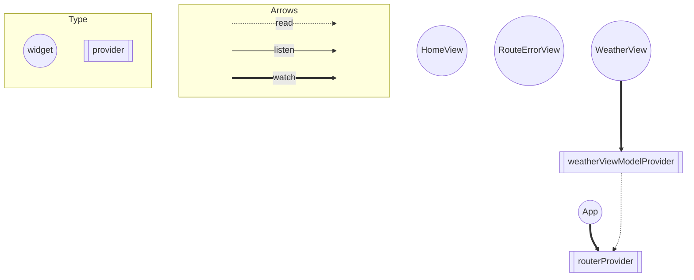

# 各種Providerについて

### routerProvider

- ルーティングの設定を行う
- `lib/router.dart`に記述
- ルーティング時にエラーが発生した場合、`RouteErrorView`に遷移する

### weatherViewModelProvider

- WeatherViewのViewModelを提供する
- `lib/ui/view/weather_view/weather_viewmodel.dart`に記述

# 各種Viewについて
### App
- `lib/ui/app.dart`に記述
- 上位のWidget

### HomeView
- `lib/ui/view/home_view/home_view.dart`に記述
- 緑色の画面
- 指定時間後に`WeatherView`に遷移する

### WeatherView
- `lib/ui/view/weather_view/weather_view.dart`に記述

